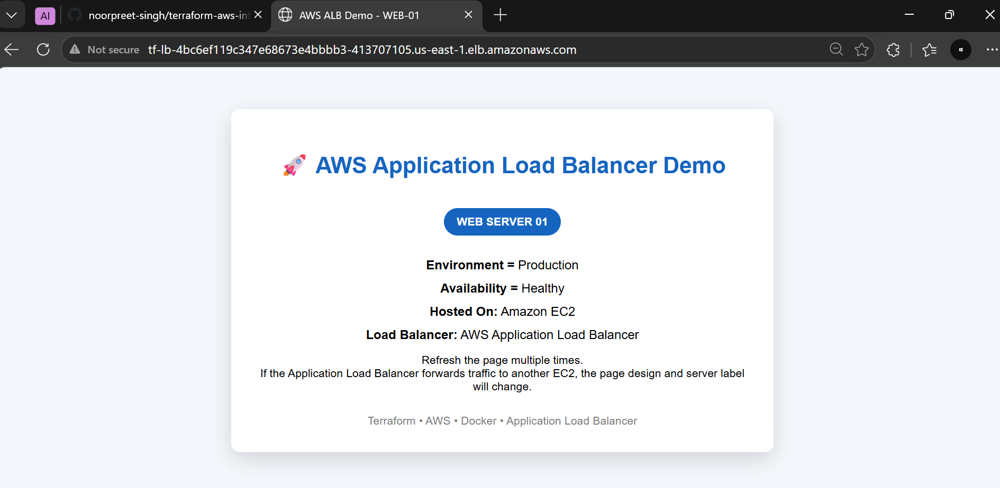
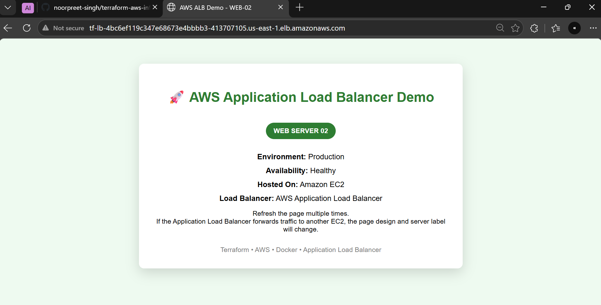
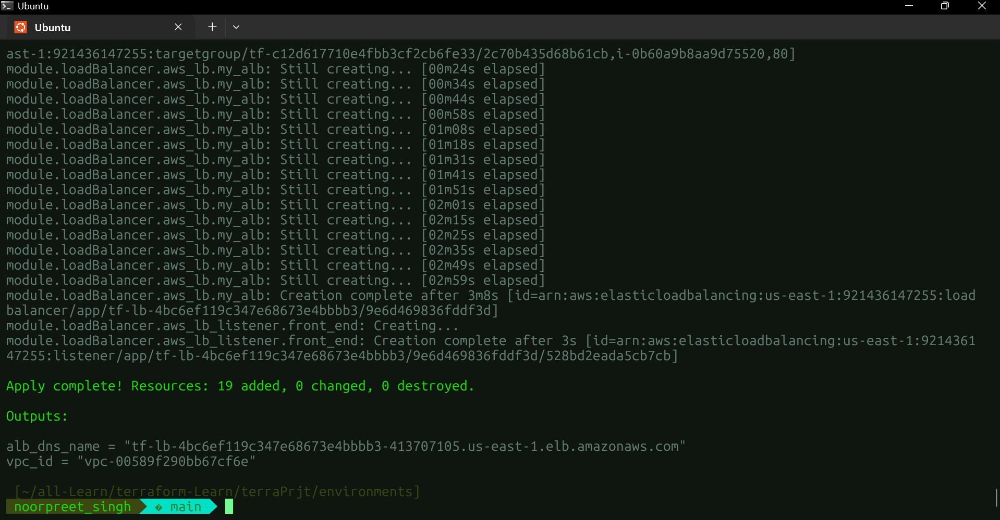

# AWS Load-Balanced Infrastructure with Terraform

Second project in my cloud/DevOps journey. This one is pure infrastructure-as-code — I used Terraform to provision a small, load-balanced setup on AWS: two EC2 instances sitting behind an Application Load Balancer, with the ALB's access logs stored in S3. Everything is written as reusable modules instead of one big file.

## What This Project Does

- Provisions a VPC with two public subnets (in different Availability Zones)
- Launches one EC2 instance in each subnet, each bootstrapped with its own userdata script
- Puts an Application Load Balancer in front of both instances, so incoming traffic gets distributed between them
- Stores the ALB's access logs in an S3 bucket
- All of it built as four separate, reusable Terraform modules

## Architecture

```
                          Internet
                             |
                    Application Load Balancer
                       /                \
           Public Subnet A          Public Subnet B
          (EC2 Instance 1)         (EC2 Instance 2)

              ALB access logs  ---->  S3 Bucket
```

## Project Structure

```
environments/
├── provider.tf         # AWS provider config
├── variable.tf         # input variables for this environment
├── main.tf             # wires up all four modules below
├── output.tf           # exposes useful outputs (e.g. ALB DNS name)
└── modules/
    ├── vpc/             # VPC, public subnets, route tables, internet gateway
    ├── ec2/              # 2 EC2 instances + their userdata scripts
    ├── alb/              # Application Load Balancer, target group, listener
    └── s3/               # S3 bucket + policy for ALB access logs
```

Each module has its own `main.tf`, `variable.tf`, and `output.tf`, so any of them can be reused or swapped out on their own.

## Module Breakdown

| Module | What it creates |
|--------|------------------|
| `vpc`  | VPC, 2 public subnets, internet gateway, route tables |
| `ec2`  | 2 EC2 instances (one per subnet), each bootstrapped with its own userdata script |
| `alb`  | Application Load Balancer + target group + listener, routing traffic to both instances |
| `s3`   | S3 bucket that stores the ALB's access logs |

## Tech Used

- Terraform
- AWS — VPC, EC2, Application Load Balancer, S3
- Bash (userdata scripts)

## Prerequisites

- Terraform installed
- An AWS account with credentials configured (`aws configure`)

## How to Deploy

```
git clone <this repo>
cd environments
terraform init
terraform plan
terraform apply
```

Once `apply` finishes, grab the ALB's DNS name from the output and open it in a browser. Refresh a few times — you should see the load balancer sending requests to both instances.

## Screenshots




##

*browser hitting the ALB's DNS name, refreshed by couple of times so both instances respond.*



*A successful `terraform apply` run in the terminal with all resources created.*

## What I Learned

This was my first multi-module Terraform project instead of one flat file. Splitting VPC, EC2, ALB, and S3 into separate modules taught me how to pass values between modules using inputs and outputs, and how an ALB actually distributes traffic and logs to S3 under the hood.
